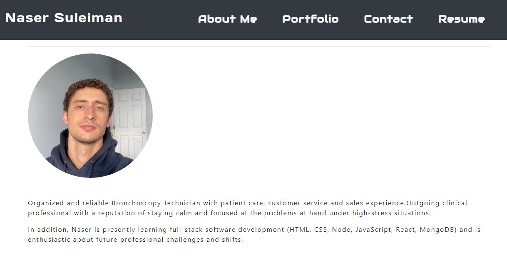

# React Portfolio Challenge

## Description 

I'd like to take this opportunity to welcome you to my React.js built portfolio. It contains subsections called Resume, Portfolio, Contact and About page. On the Portfolio tab, you can find a list of my favorite applications. On the page dedicated to my resume, you will discover a list of my skills and a link to download my résumé. You can find connections to my LinkedIn and GitHub at the bottom.

## License 
This project is license under MIT 


## Installation 

1. First clone the repository
1. Install `node.js`
1. Run `npm install` to install the respective dependencies. 
1. Run `npm start` in order to start the web server and connect

## User Story

```md
AS AN employer looking for candidates with experience building single-page applications
I WANT to view a potential employee's deployed React portfolio of work samples
SO THAT I can assess whether they're a good candidate for an open position
```

## Screenshots 



## Link 
<a href=" ">Live Link</a>